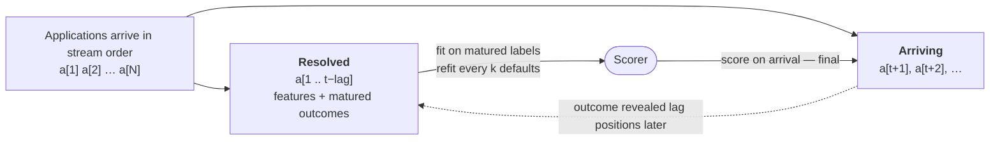

# PaMIR

**P**ublic **A**rrival-ordered **M**easurement for **I**nference in **R**isk

[](https://pypi.org/project/pamir/)
[](https://arxiv.org/abs/2610.03259)
[](https://github.com/zypl-ai/pamir/blob/main/LICENSE)

Paper: [*PaMIR: Open Benchmark of Public Credit-Default Datasets*](https://arxiv.org/abs/2610.03259)
(arXiv:2610.03259) — describes release 0.4.0.

*The name doubles as the Pamir mountains — the "Roof of the World"; the datasets
themselves span Poland, Taiwan, Brazil, Estonia, the US and beyond.*

An open benchmark for **credit-default prediction when labels are scarce and
arrive late**.  PaMIR rebuilds **19 public credit-default datasets** (1.2 million
rows, 9 named countries, default rates 3%–41%) from pinned source snapshots by
one leakage-audited recipe and never redistributes them; to our knowledge it is
the one of its kind as of today.  Every model is a single function,
scored under a **label-delayed stream**, in which each application is scored on
arrival by a model trained only on outcomes that have matured, with AUC
reported by label budget, and under a conventional **i.i.d. split** for
comparison with other tabular benchmarks.  A leakage-controlled
**synthetic-data harness** tests the remedy most often proposed for scarce
labels.  Because a model is one function, PaMIR can run as a credit track next
to general benchmarks such as TabArena and BeyondArena.

## Why another benchmark?

Credit-scoring methods are usually compared on two or three small public tables,
and the reference multi-dataset credit studies are not reproducible: Baesens et
al. (2003) and Lessmann et al. (2015) use eight datasets each, of which two and
four are public.  General tabular benchmarks contain credit tasks, but evaluate
them on random, temporal or grouped splits.  A credit model is trained on
outcomes that mature months or years after origination, and starts with no
labels at all; a temporal split orders the data by time but can still train on
outcomes that matured after its cut-off.  PaMIR targets that constraint:

- Applications arrive in a **stream**, and each is scored once, on arrival.
- Outcomes are revealed only after a **maturation delay**.
- A model deployed on day one has **no labels**; its learning curve under the
  delay is part of the result (the label-budget curve).

PaMIR replays each dataset in a fixed random order — most sources carry no
usable origination dates — so the stream has no calendar drift: the protocol
measures learning under scarce, delayed labels, not robustness to temporal
shift.

### Comparison with existing benchmarks

| Benchmark | Datasets | Domain | Evaluation |
|---|---|---|---|
| OpenML-CC18 | 72 | General | i.i.d. cross-validation |
| TabArena | 51 | General | i.i.d. cross-validation |
| MultiTab | 196 | General | i.i.d. splits |
| TableShift | 15 | General | explicit domain shifts |
| TabReD | 8 | Industrial | time-based splits |
| BeyondArena | 142 | General (11 credit-default) | i.i.d., temporal and grouped splits |
| Lessmann et al. (2015) | 8 (4 public) | Credit | i.i.d. splits |
| **PaMIR** | **19** | **Credit default** | **i.i.d. and label-delayed streaming** |

Counts are as reported by each benchmark's paper; the BeyondArena credit-default
count is ours, from its dataset table as published in June 2026.

## Synthetic augmentation

`pamir.synthetic` mixes real and synthetic training rows in stated proportions
across several generators at once, fits every generator **inside** the
cross-validation fold, and reports both the AUC delta and a full fidelity
battery:

```python
from sdv.single_table import GaussianCopulaSynthesizer

from pamir import load_dataset
from pamir.synthetic import CrossValidatedAugmentation, SDVAdapter, SyntheticMixer

mixer = SyntheticMixer(
    generators={"copula": SDVAdapter(GaussianCopulaSynthesizer, name="copula")},
    synthetic_share=0.5,                   # 50% synthetic / 50% real
)

X, y, _ = load_dataset("south_german")
result = CrossValidatedAugmentation(mixer, n_splits=5, seed=42).run(X, y)

result.summary()             # baseline vs augmented OOF AUC, and the delta
result.leakage_frame()       # the probes that say whether to believe that delta
result.fidelity_headline()   # the few fidelity numbers worth reading first
```

`SDVAdapter` takes any SDV synthesizer and needs only the `synthetic` extra.
Adapters also wrap a pool of pre-generated rows (`PoolAdapter`) or any object
with `fit` and `sample` methods (`CallableAdapter`), and several generators mix
by `weights`.  The package also contains adapters for two generators developed
at zypl.ai (`ZganAdapter`, `ZedgeAdapter`); those generators are distributed
separately and are not evaluated by PaMIR (see *Conflict of interest* below).

Generators never see a held-out row: the split happens first, each fold gets a
freshly reset generator, the test split is never augmented, and pre-generated
pools must be registered per fold.  The exact-overlap probes that verify this
run even with `fidelity=False`, and hash rows under the real table's schema, so
an engine that returns a column as floats — or as text — cannot slip a
reproduced row past them.  See the synthetic-augmentation guide in `docs/synthetic.md`.

## Installation

```bash
pip install "pamir[data]"
```

To work on PaMIR itself, install from a clone instead:

```bash
git clone https://github.com/zypl-ai/pamir
cd pamir
pip install -e ".[data]"
```

PaMIR ships the catalog, the harmonization recipe and the evaluation code —
**not the datasets**.  Each dataset is fetched from its original source and
harmonized locally on first use (then cached).  The `[data]` extra installs the
fetch dependencies (`kagglehub`, `huggingface-hub`, `platformdirs`).  Twelve
datasets are hosted on Kaggle: kagglehub 1.0 downloads these public datasets
without an account (checked with kagglehub 1.0.2), older versions need Kaggle
credentials.  The other seven come from UCI, GitHub and Hugging Face and need
nothing; `pamir.download_open()` fetches exactly those.

Core dependencies: numpy, pandas, scikit-learn, scipy, pyarrow.  No GPU required.

Optional extras:

```bash
pip install "pamir[synthetic]"  # sdv, sdmetrics, xgboost — for pamir.synthetic
pip install "pamir[dev]"        # pytest
```

### A note on import order (macOS/arm64)

`sdv` imports `torch`, and `torch` and `xgboost` each ship their own OpenMP
runtime.  On macOS/arm64, loading torch first makes the next `xgboost.train()`
die with a bare `Segmentation fault: 11` and no traceback:

```python
import sdv, xgboost   # xgboost.train() later segfaults
import xgboost, sdv   # fine
```

`import pamir.synthetic` loads xgboost for you before anything touches sdv, so
importing PaMIR first is enough.  If your own script imports sdv directly,
put `import xgboost` above it.

## Quick start

```python
from pamir import load_catalog, load_dataset, evaluate, evaluate_iid, fleet_summary
from pamir import gbdt_fit, gbdt_baseline     # the same model, in both forms

catalog = load_catalog()                      # one row per dataset
print(catalog[["name", "rows", "DR", "geography", "license"]])

X, y, meta = load_dataset("gmsc")             # features, binary target, metadata
print(f"{meta['name']}: {meta['n_rows']} rows, {meta['n_defaults']} defaults")

results = evaluate(gbdt_fit)                  # streaming protocol, reference setting
fleet_summary(results)                        # headline AUC — and whether it is valid

results_iid = evaluate_iid(gbdt_baseline, n_seeds=5)   # conventional i.i.d. split
```

### Writing your own model

The streaming protocol calls a **`fit_fn(X_train, y_train) -> scorer`**; the
returned **`scorer(X_rows) -> scores`** scores rows as they arrive.  The i.i.d.
protocol calls a **`predict_fn(X_train, y_train, X_test) -> scores`**.  Higher
scores mean a higher probability of default.  `X` arrives with raw dtypes —
most of the datasets carry `object` or `bool` columns — so encode them, using
only the training rows:

```python
from pamir.baselines import apply_encoder, fit_encoder

def my_fit(X_train, y_train):
    from sklearn.linear_model import LogisticRegression
    levels = fit_encoder(X_train)            # category levels from the training rows
    clf = LogisticRegression(max_iter=1000)
    clf.fit(apply_encoder(levels, X_train).fillna(0), y_train)
    return lambda X: clf.predict_proba(apply_encoder(levels, X).fillna(0))[:, 1]

def my_predict(X_train, y_train, X_test):    # the same model for evaluate_iid
    return my_fit(X_train, y_train)(X_test)
```

A scorer must score each row on its own.  The streaming protocol passes it the
rows that arrived since its refit in one batch and checks, on every batch, that
a random subset scored alone gets the same scores; a scorer that, say, encodes
categories against the batch's own levels fails that check, and the run gets no
fleet mean.  A three-argument `predict_fn` is accepted by `evaluate` too
(`pamir.from_predict_fn` wraps it, one fit per scoring batch).

### Always check the summary

If the model raises, the affected rows go unscored.  `evaluate` records every
failure rather than discarding it, and `fleet_summary` withholds the headline
mean unless the run is valid — because an average over the datasets a model
survived is not comparable with one over all of them:

```python
results = evaluate(my_fit)
summary = fleet_summary(results)

summary["complete"]              # every dataset scored
summary["contract_ok"]           # every table matched its data contract
summary["row_independent"]       # every scorer scored rows independently
summary["auc_mean"]              # None unless all three hold
summary["failed_datasets"]       # which ones, and results["errors"] says why
summary["auc_by_budget"]         # AUC by the number of labels behind each score
```

While developing, pass `on_error="raise"` to get the traceback instead.

### Report your protocol parameters

`mode`, `lag`, `max_lag_frac`, `k_refit` and `max_n` change the score, not just
the runtime.  Two runs are comparable only when all of them match.  The package
defaults — **`mode="arrival"`, `lag=1000`, `max_lag_frac=0.2`, `k_refit=10`,
`max_n=20000`** — are the reference setting; report them alongside any number,
and state any deviation.

## The streaming protocol

The protocol simulates a lender deploying a model on an arriving stream of
loan applications.



The rules:

1. **Stream order.**  Applications arrive in the order they are stored: a
   fixed random permutation of the source, because file order in the sources
   is an export artefact, not an origination sequence.
2. **Label-maturation delay.**  The outcome of the application at position *t*
   is revealed at position *t + lag* (`lag=1000`, capped at 20% of the stream
   for short datasets).  At any moment the latest `lag` applications are
   unlabelled.
3. **Refit cadence.**  The model is refitted once `min_defaults` defaults have
   resolved, then after every *k* newly resolved defaults (`k_refit=10`): the
   update schedule is driven by information arrival, not wall time.
4. **Score on arrival.**  Each application is scored once, by the scorer that
   was current when it arrived; that scorer was trained only on outcomes that
   had matured by then.  Scores are final.
5. **Metric.**  ROC AUC over every scored application, plus the AUC by label
   budget.  Applications that arrive before the first refit are not scored.

The 0.3.0 protocol, which re-scored the whole remaining stream at every refit
(including applications that had not yet arrived), remains available as
`mode="refresh"` to reproduce 0.3.0 numbers; see `docs/protocol.md`.

## Datasets

All 19 datasets (1,237,550 rows, 281,766 defaults, DR 3.2–40.9%):

| id | name | rows | DR | geography | product | license |
|---|---|---|---|---|---|---|
| bankruptcy | Taiwanese Bankruptcy Prediction | 6,819 | 3.2% | Taiwan | Corporate | © authors |
| bondora | Bondora P2P Lending | 266,482 | 40.9% | Estonia, Finland, Spain | P2P consumer | CC0 |
| conorsully | Conor Sully Credit Score | 1,000 | 28.4% | Synthetic / educational | Consumer | CC0 |
| dish | Automobile Loan Default | 121,856 | 8.1% | Unspecified | Vehicle finance | CC0 |
| gastonstat | Gaston Sanchez Credit Scoring | 4,454 | 28.1% | Unknown | Consumer | None |
| gmsc | Give Me Some Credit | 150,000 | 6.7% | USA | Consumer revolving + installment | Unknown |
| laotse | Laotse Credit Risk | 32,581 | 21.8% | Unspecified | Consumer | CC0 |
| lc_clean | Lending Club (cleaned, 2007–2014) | 150,000 | 20.2% | USA | P2P consumer | None |
| lc_my | Lending Club (Malaysian variant) | 100,000 | 22.6% | Unspecified | Consumer | Unknown |
| lc_small | Lending Club (small, 9,578 loans) | 9,578 | 16.0% | USA | Consumer | ODbL |
| lt_vehicle | L&T Vehicle Loan Default | 233,154 | 21.7% | India | Vehicle finance | Other |
| pakdd | PAKDD 2010 Credit Data | 50,000 | 26.1% | Brazil | Consumer | None |
| poland_1yr | Polish Companies Bankruptcy (1-year horizon) | 7,027 | 3.9% | Poland | Corporate | CC-BY-4.0 |
| poland_3yr | Polish Companies Bankruptcy (3-year horizon) | 10,503 | 4.7% | Poland | Corporate | CC-BY-4.0 |
| poland_5yr | Polish Companies Bankruptcy (5-year horizon) | 5,910 | 6.9% | Poland | Corporate | CC-BY-4.0 |
| prosper | Prosper Marketplace Loans | 55,084 | 30.9% | USA | P2P consumer | CC0 |
| sba | U.S. SBA Loan Defaults | 2,102 | 32.6% | USA | Small business | CC0 |
| south_german | South German Credit (corrected) | 1,000 | 30.0% | Germany | Consumer | CC-BY-4.0 |
| taiwan | Taiwan Credit Card Default | 30,000 | 22.1% | Taiwan | Credit card | CC0 |

**Inclusion criteria:**  a flat table (or reducible to one by the recipe),
binary default target, publicly downloadable, ≥1,000 rows, ≥3% default rate.

### Data provenance and harmonization

PaMIR distributes no data.  `pamir.download(id)` fetches the raw file from the
dataset's original source and harmonizes it locally with a reproducible recipe
(`pamir.harmonize`), so every user reconstructs the identical table.  The recipe
per dataset (in the catalog's `download` / `harmonize` fields):

- **Target binarization** — a numeric parse or a dataset-specific rule; stored
  as `__target__` (0 = non-default, 1 = default).
- **Rescaling** (lc_my): Credit Score inflated 10x on defaulter rows is divided
  back down.
- **Post-outcome leakage removal (semantic cut)** — every column the
  elicitation marked `day_zero_available = false` (not known to the lender at
  decision time) is dropped, plus dataset-specific extra drops
  (e.g. `sba`: `Term`, `RealEstate`, `daysterm`).  This replaces the earlier
  `AUC > 0.95` rule, which let sets of individually-weak columns leak the
  outcome together.
- **Column hygiene** — drop id / date / constant / surrogate-key columns.
- **Row shuffle** — fixed seed; file order is not an origination sequence.

Each rebuilt table is checked against its **data contract** in
`pamir/data/expected.json` — feature columns, row and default counts, and
SHA-256 digests of the raw file and of the target vector in stored order.  A
table that does not match is refused (`pamir.ContractError`) rather than cached,
and a cached table is re-checked on every load; `strict=False` keeps a
mismatching table, flagged `contract_ok = False`, and such a run gets no fleet
mean.  The catalog pins the source snapshot (a Kaggle version, a Hugging Face
revision).  `pamir.dataset_info(id)` returns the full recipe, with `source`
(where the data originate) and `fetched_from` (what the downloader retrieves).

## API reference

### `pamir.load_catalog() → DataFrame`

One row per dataset, indexed by `id`.  Columns include `name`, `rows`,
`features`, `defaults`, `DR`, `source`, `source_url`, `fetched_from`, `license`,
`geography`, `product`, `target_definition`.

### `pamir.list_datasets() → list[str]`

The sorted list of dataset ids.

### `pamir.dataset_info(dataset_id) → dict`

The full metadata dictionary for one dataset.  Raises `KeyError` if the id is
not in the catalog.

### `pamir.download(dataset_id, force=False, quiet=False, strict=True) → Path`

Fetch one dataset from its pinned source, harmonize it, check it against its
data contract and cache it as parquet (with a provenance record).  Called
automatically by `load_dataset` on first use.  Cache location: `platformdirs`
user cache, or `$PAMIR_CACHE`.  With `strict=True` a mismatching table raises
`pamir.ContractError` and nothing is cached.

### `pamir.load_dataset(dataset_id, max_rows=None, auto_download=True, strict=True) → (X, y, meta)`

Load a single dataset from the local cache (downloading it first if needed;
set `auto_download=False` to require an explicit `download`).  The cached table
is re-checked against its contract on every load.

- **X**: DataFrame of features exactly as stored — `int64`, `float64`, `bool`
  and `object` all occur, and most of the datasets carry at least one
  non-numeric column.  Nothing is encoded or imputed for you.
- **y**: numpy array of int (0 = non-default, 1 = default).
- **meta**: dataset metadata plus `n_rows`, `n_defaults`, `n_features`,
  `contract_ok`, `contract_issues` and `snapshot_verified`.  `notes` is present
  only on the datasets that required harmonization, so read it with `.get()`.

### `pamir.logistic_fit(X_train, y_train) → scorer`, `pamir.gbdt_fit(X_train, y_train, max_iter=150, ...) → scorer`

The reference baselines as `fit_fn`s, for the streaming protocol.
`pamir.logistic_baseline` / `pamir.gbdt_baseline` are the same models as
`predict_fn`s, for the i.i.d. protocol.  Non-numeric columns are encoded
against the training rows' levels (`pamir.baselines.fit_encoder` /
`apply_encoder`).  `logistic_baseline_v03` / `gbdt_baseline_v03` are the 0.3.0
baselines, kept to reproduce 0.3.0 numbers.

### `pamir.encode_features(X_train, X_test) → (train, test)`

Ordinal-encode the non-numeric columns of both frames against one shared level
set.  Legal in the i.i.d. protocol, where the model is handed the rows it must
score; in the streaming protocol it would let a row's code depend on rows that
arrived after it, which the row-independence check flags.

### `pamir.evaluate(model, datasets=None, lag=1000, k_refit=10, max_n=20000, mode="arrival", max_lag_frac=0.2, ...) → DataFrame`

Run the streaming protocol on all (or a subset of) datasets.  `model` is a
`fit_fn` (or a `predict_fn`, wrapped); in `mode="refresh"` it is a
`predict_fn` called with the resolved prefix and the remaining stream.

**on_error** — `"warn"` (default) records the failure, warns once per dataset
and carries on; `"raise"` propagates the traceback; `"ignore"` records it
silently.  Failures are counted under every policy.

Returns a DataFrame with columns `dataset`, `mode`, `n_rows`, `n_defaults`,
`DR`, `lag_effective`, `k_refit`, `n_refits`, `n_refits_ok`, `n_calls`,
`n_failures`, `n_scored`, `contract_ok`, `row_independent`, `auc_final` and, in
arrival mode, `auc_budget_0` … `auc_budget_10000`.  Pass it to
`pamir.fleet_summary` — a mean taken by hand over this frame silently excludes
the datasets the model failed on.

### `pamir.evaluate_one(model, dataset_id, ...) → dict`

Same as `evaluate` for a single dataset, plus `refit_points` (per-refit
cumulative AUC), `errors` (the distinct failure messages, up to five) and, in
arrival mode, `train_n` (the label budget behind each row's score).

### `pamir.evaluate_iid(predict_fn, datasets=None, train_frac=0.7, max_n=None, n_seeds=5, verbose=True, on_error="warn", strict=True) → DataFrame`

Conventional i.i.d. train/test evaluation on the PaMIR fleet, for comparison
with other tabular benchmarks.  Each dataset is permuted `n_seeds` times; the
reported AUC is the mean across seeds.  Columns: `dataset`, `n_rows`,
`n_defaults`, `DR`, `train_frac`, `n_seeds`, `n_calls`, `n_failures`,
`contract_ok`, `auc_mean`, `auc_std`.

### `pamir.evaluate_iid_one(predict_fn, dataset_id, ...) → dict`

Same as `evaluate_iid` for a single dataset, plus `aucs` (per-seed AUCs) and
`errors`.

### `pamir.fleet_summary(results) → dict`

Summarize a frame from either protocol.  Keys:

| key | meaning |
|---|---|
| `n_datasets`, `n_scored`, `coverage` | how much of the fleet was scored |
| `complete` | `True` only when every dataset produced an AUC |
| `contract_ok`, `row_independent` | every table was the benchmark table; every scorer was row-independent |
| `auc_mean`, `gini_mean` | the headline numbers — `None` unless all of the above hold |
| `auc_mean_scored_only` | the partial average; diagnostic only, not comparable |
| `n_failures`, `failed_datasets` | what went wrong and where |
| `auc_by_budget` | arrival mode: mean AUC per label-budget group, and how many datasets reach it |

The headline mean is withheld on a partial run by design: an average over the
datasets a model survived is chosen by the model's own failures, and can read
*higher* than a working model's average over all of them.

## Reference baselines

Two baselines ship with the package.  Both run on every dataset without edits,
and neither needs an optional dependency:

```python
from pamir import evaluate, evaluate_iid, fleet_summary
from pamir import logistic_fit, gbdt_fit, logistic_baseline, gbdt_baseline

fleet_summary(evaluate(logistic_fit))          # streaming, reference setting
fleet_summary(evaluate(gbdt_fit))
fleet_summary(evaluate_iid(logistic_baseline)) # i.i.d.
fleet_summary(evaluate_iid(gbdt_baseline))
```

To use XGBoost instead, encode against the training rows first:

```python
def xgboost_fit(X_train, y_train):
    import xgboost as xgb
    from pamir.baselines import apply_encoder, fit_encoder

    levels = fit_encoder(X_train)
    bst = xgb.train({"objective": "binary:logistic", "max_depth": 6, "eta": 0.1},
                    xgb.DMatrix(apply_encoder(levels, X_train), label=y_train), 200)
    return lambda X: bst.predict(xgb.DMatrix(apply_encoder(levels, X)))
```

### Cost

In the streaming protocol every refit is one fit plus the scoring of the rows
that arrived since the previous one; at the reference setting the fleet takes
about 4,700 refits (an estimate from the catalog's row counts and default
rates), most of them on the larger, high-default-rate datasets.  `logistic_fit` is the cheap reference point; raise `k_refit` (and
report it) to trade resolution for time.  The refresh mode is more expensive:
each of its refits scores the whole remaining stream.

## Documentation

### Sphinx docs (local)

Build and view the full documentation:

```bash
pip install -e ".[dev]"
pip install sphinx furo sphinx-copybutton sphinx-autodoc-typehints sphinx-llms-txt myst-parser
sphinx-build -b html docs docs/_build/html
open docs/_build/html/index.html
```

Features: Furo theme with dark/light toggle, copy button on all code blocks,
autodoc-generated API reference from docstrings.

### LLM-readable docs

The Sphinx build automatically generates two files for LLM consumption:

- **`llms.txt`** — structured index with links to each documentation page.
- **`llms-full.txt`** — the entire documentation concatenated into a single
  plain-text file (~800 lines).

Any LLM agent can download `yoursite.com/llms.txt` to understand the full
PaMIR API and protocol in one request.

### HuggingFace dataset card

The `huggingface_card/README.md` is the dataset card for the HuggingFace Hub
repo.  It contains YAML metadata (tags, configs, license) that makes the
benchmark discoverable through HF search filters, plus a standalone description
of the benchmark and its datasets.  The card hosts no data.

## Running tests

```bash
pip install -e ".[dev]"
pytest tests/ -v
```

The test suite covers: catalog integrity (the dataset list matches the catalog,
all metadata fields, DR/feature consistency, version consistency across release
files), the data contract (exact validation, refusal on download and on load),
harmonized loading, the leakage guards and a positive control for each,
streaming-protocol invariants on synthetic streams (a scorer sees only rows
that arrived after its refit and labels that had matured, every score is final,
the delay cap, the row-independence check, and that the refresh mode
reproduces 0.3.0), the i.i.d. protocol, failure accounting (a partial run yields
no fleet mean), the reference baselines on every dataset, and data quality (no
duplicates, no constant features).  The `pamir.synthetic` augmentation layer
adds its own suite — fold-safe cross-validation, the exact-overlap leakage
probes, and the fidelity battery.  Data-dependent tests skip cleanly when a
dataset is not cached (CI holds no Kaggle credentials, so it checks the seven
credential-free datasets); catalog and protocol tests always run.

## License

The PaMIR package code is released under the **Apache 2.0** license — see the
`LICENSE` file at the repository root.

PaMIR **does not redistribute the datasets** — it fetches each one from its
original source at the user's request.  Each dataset remains under its own
license and terms, as listed in the catalog
(`pamir.dataset_info(id)["license"]`); when you use a dataset you are bound by
those terms and are responsible for citing its original authors.

## Conflict of interest

PaMIR is developed at zypl.ai, which also develops synthetic-data generators
(zGAN, zEDGE).  The package contains adapters for those generators so that they
can be measured by the same public protocol as any other; the generators
themselves are distributed separately, and PaMIR's releases and reports do not
evaluate them.  Any future evaluation of a maintainer's model or generator will
use the published protocol, ship with its code, and be marked as such.

## Citation

If you use PaMIR, please cite the paper and the original source of every
dataset you use (`pamir.dataset_info(id)["citation"]`):

```bibtex
@misc{liashkov2026pamir,
  title         = {PaMIR: Open Benchmark of Public Credit-Default Datasets},
  author        = {Liashkov, Mikhail and Varshavskiy, Ilyas and Khalilbekov, Shuhratjon and
                   Azimi, Azizjon and Boboeva, Bonu},
  year          = {2026},
  eprint        = {2610.03259},
  archivePrefix = {arXiv},
  primaryClass  = {cs.LG},
  url           = {https://arxiv.org/abs/2610.03259},
}
```

To cite a specific release of the software:

```bibtex
@software{pamir2026,
  title   = {PaMIR: Public Arrival-ordered Measurement for Inference in Risk},
  author  = {Liashkov, Mikhail and Varshavskiy, Ilyas and Boboeva, Bonu and
             Khalilbekov, Shuhrat and Azimi, Azizjon},
  year    = {2026},
  version = {0.4.0},
  url     = {https://github.com/zypl-ai/pamir},
}
```
