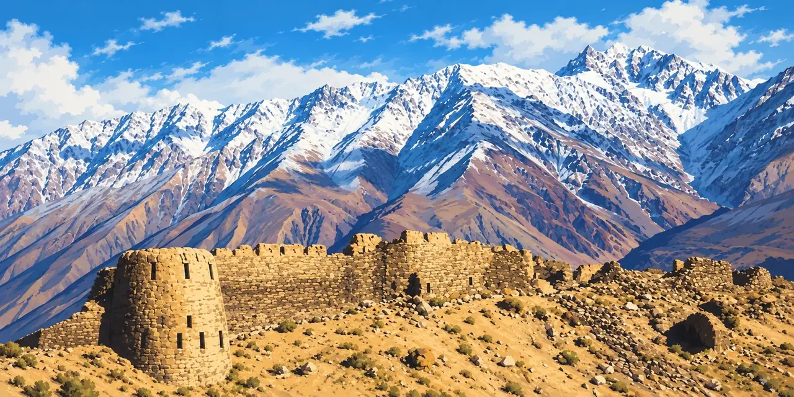

PaMIR — Public Arrival-ordered Measurement for Inference in Risk
================================================================

.. include:: ../README.md
   :parser: myst_parser.sphinx_

.. toctree::
   :maxdepth: 2
   :caption: Contents

   getting_started
   protocol
   datasets
   licenses
   synthetic
   synthetic_design
   api
   contributing

.. toctree is ordered: Getting started → Evaluation protocols → Datasets → Licenses →
.. Synthetic augmentation (guide, then design record) → API → Contributing
