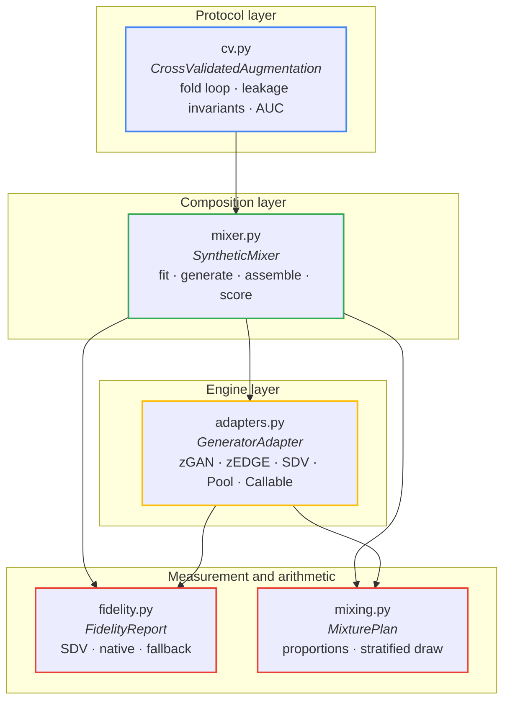
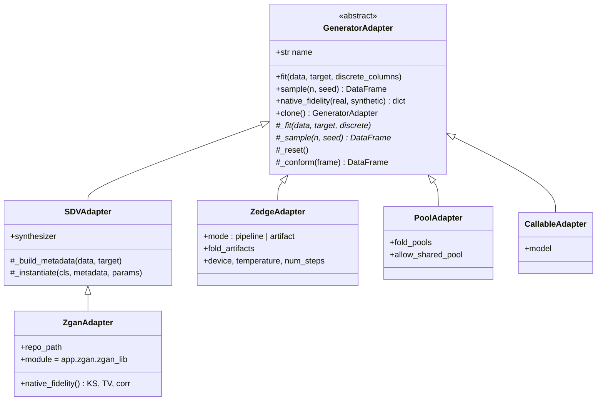
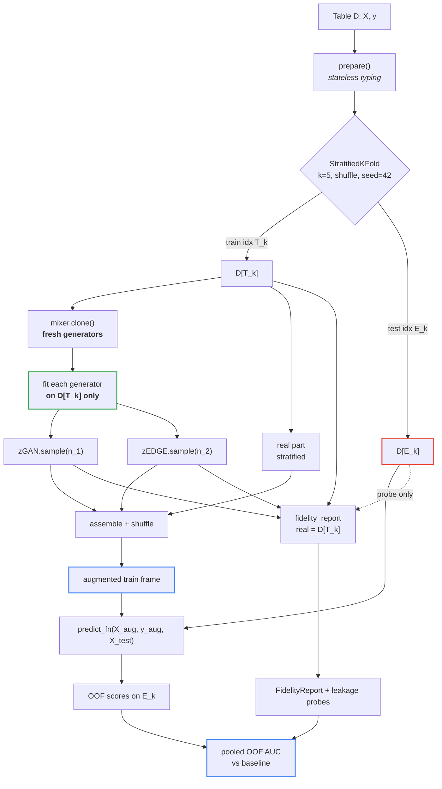
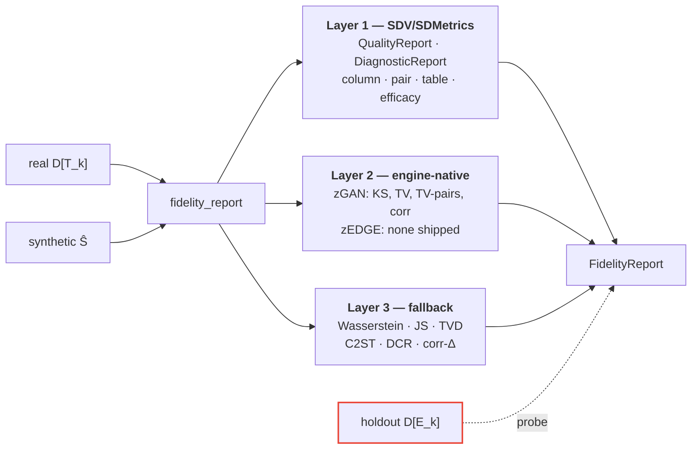

# `pamir.synthetic`: a leakage-controlled protocol for measuring synthetic training data

**Status.** Implementation complete; validated end-to-end on a PaMIR dataset with
surrogate generators (§10). The adapters for the two generators developed at
zypl.ai (zGAN, zEDGE) are tested through surrogate generators only — see §11.1.
**Scope.** Design specification and pipeline reference for
`pamir/synthetic/`.
**Companion.** [docs/synthetic.md](synthetic.md) is the user guide; this document is
the design record.

---

## 1. Problem statement

A credit-risk portfolio is small, imbalanced and expensive to label. Synthetic
data is proposed as the remedy: train on real rows *plus* generated ones and
recover the signal a 3%-default book cannot supply on its own. The claim is
routinely made and rarely measured, because measuring it correctly requires
resolving three separate questions that the literature tends to conflate:

1. **Composition.** In what proportion should real and synthetic rows be mixed,
   and — when several generators are available — how should the synthetic part
   be divided among them?
2. **Fidelity.** How close is the synthetic sample to the real distribution, and
   along which axis: marginals, dependence structure, or downstream utility?
3. **Validity.** Does the measured gain survive a protocol in which the generator
   provably never observed the evaluation rows?

Question 3 dominates. A generator fitted on the full table before
cross-validation has, by construction, seen every fold's test rows; its synthetic
output then carries information about the held-out labels, and the resulting AUC
uplift is an artefact. The failure is silent: nothing in the code errors, and
the number that comes out is simply too high. This module is built so that the
failure is structurally impossible rather than merely discouraged.

Let $\mathcal{D} = \{(x_i, y_i)\}_{i=1}^{n}$ be a labelled table, $\mathcal{G}$ a
generator, and $\pi$ an evaluation protocol. The quantity of interest is

$$\Delta(\mathcal{G}, \pi) \;=\; \mathrm{AUC}_\pi(\mathcal{D} \cup \mathcal{S}) - \mathrm{AUC}_\pi(\mathcal{D}),$$

where $\mathcal{S} \sim \mathcal{G}$. $\Delta$ is interpretable **only** if
$\mathcal{G}$ was fitted on a subset of $\mathcal{D}$ disjoint from the rows on
which $\mathrm{AUC}_\pi$ is computed. Section 5 states the invariants that
enforce this and the probes that verify it.

---

## 2. Architecture

Five modules, layered so that each depends only on those below it. The dependency
graph is acyclic and the two lower layers have no optional dependencies at all.



| Module | Responsibility | Hard dependencies |
|---|---|---|
| `mixing.py` | Proportion algebra; stratified and exact row selection | numpy, pandas |
| `fidelity.py` | Three-layer metric battery; leakage probes | numpy, pandas, scipy, scikit-learn |
| `adapters.py` | Uniform `fit`/`sample` contract over heterogeneous engines | numpy, pandas |
| `mixer.py` | Fold-local composition: fit → generate → assemble → score | the three above |
| `cv.py` | Cross-validated protocol, baseline arm, pooled OOF AUC | scikit-learn; xgboost optional |

The separation is not cosmetic. `mixing.py` is pure arithmetic and is tested
exhaustively without any generator; `mixer.py` is deliberately **fold-local** —
it has no notion of cross-validation and therefore cannot leak across folds;
`cv.py` owns the split and is the only module that ever holds both a training
and a test partition simultaneously.

---

## 3. The adapter contract

Engines differ radically. zGAN is an in-process SDV synthesizer subclassing
`BaseSingleTableSynthesizer`; zEDGE is a latent-diffusion pipeline driven through
artifact directories on disk and, in production, an HTTP service; a third engine
may exist only as a CSV of rows produced last night on a GPU box. A single
abstraction covers all three:

$$\mathcal{A}: \quad \texttt{fit}(D_{\text{train}}) \rightarrow \texttt{sample}(n, \text{seed}) \rightarrow \hat{D} \in \mathbb{R}^{n \times p}$$



Three properties of the base class matter for correctness:

**Schema conformance.** `_conform` forces every generated frame onto the exact
column set and order observed at `fit` time, raising if a column is missing. A
generator that silently drops a categorical column would otherwise produce a
mixed frame with misaligned features.

**Statelessness across folds.** `clone()` deep-copies the adapter and calls
`_reset()`, which discards the fitted model and returns the engine to its
prototype. `cv.py` clones the mixer — and therefore every adapter — once per
fold. The template held by the caller is never fitted.

**Fold binding.** Adapters that read pre-computed material (`PoolAdapter`,
`ZedgeAdapter` in `artifact` mode) carry a `fold` attribute set by the mixer. If
a single pool or artifact is supplied for a multi-fold run, `fit` raises rather
than proceeds: one pool generated from the whole table has seen every fold's test
rows. The keyed forms `fold_pools={k: pool}` and `fold_artifacts={k: dir}` are
the supported path; `allow_shared_pool=True` exists as an explicit, documented
override for the single-split case.

`as_adapter` dispatches on what the caller supplies — an adapter, an SDV class or
instance, a DataFrame or file path, or any object exposing `fit`/`sample` — so
`generators={"zgan": zyplGANSynthesizer}` is valid without naming an adapter.

---

## 4. Composition algebra

Two orthogonal parameters govern the mix. Let $s \in [0,1)$ be the synthetic
share and $\{w_g\}_{g \in G}$ the generator weights, normalised to
$\tilde{w}_g = w_g / \sum_h w_h$. A caller who wants an exact row count passes
$n_{\text{syn}}$ directly instead of $s$; the two are mutually exclusive and
naming both raises, since one would otherwise have to lose silently. Under
cross-validation the distinction is not cosmetic: $s$ resolves against each
fold's train split and so varies fold to fold, while a count does not.

**Sizing `keep_real`** (default) retains every real training row and adds
synthetic rows until the share is met:

$$n_{\text{real}} = n, \qquad n_{\text{syn}} = \left\lfloor n \cdot \frac{s}{1-s} \right\rceil, \qquad N = n_{\text{real}} + n_{\text{syn}}.$$

**Sizing `fixed_total`** pins the frame to $N$ rows and subsamples the real part:

$$n_{\text{syn}} = \lfloor N s \rceil, \qquad n_{\text{real}} = N - n_{\text{syn}},$$

raising if $n_{\text{real}} > n$. The two answer different questions —
*"does adding synthetic data help?"* versus *"at equal training size, is
synthetic data as good as real?"* — and conflating them is a common reporting
error, since `keep_real` increases the training set while `fixed_total` holds it
constant.

The synthetic part is divided by the **largest-remainder method**, which
guarantees $\sum_g n_g = n_{\text{syn}}$ exactly:

$$n_g = \lfloor n_{\text{syn}} \tilde{w}_g \rfloor + \mathbb{1}\left[g \in R\right], \qquad |R| = n_{\text{syn}} - \sum_h \lfloor n_{\text{syn}} \tilde{w}_h \rfloor,$$

where $R$ holds the generators with the largest fractional remainders, ties
broken by name so the result is deterministic and reproducible across runs.

> **Worked example.** $n = 1000$, $s = 0.7$, $w = \{\text{zgan}: 0.5,
> \text{zedge}: 0.5\}$ gives $n_{\text{syn}} = 2333$, split $1166 / 1167$ — a
> frame of 3333 rows that is 30.0% real, 35.0% zGAN and 35.0% zEDGE. The exact
> tie on the remainder resolves to `zedge` by name.

Two further controls:

- **Stratification.** When a target column is declared, every subsample preserves
  the class distribution by largest remainder over strata, so the real part of a
  3%-default book does not drift in base rate through sampling noise.
- **Class rebalancing.** `synthetic_target_rate` forces the synthetic part to a
  chosen positive rate — the usual motivation for reaching for a generator at
  all. It draws `oversample × n` rows and selects to quota, raising with a
  diagnostic if the pool cannot supply enough of a class rather than silently
  returning a skewed frame.

---

## 5. The leakage protocol

### 5.1 Invariants

Let $(T_k, E_k)$ be the training and evaluation index sets of fold $k$, with
$T_k \cap E_k = \varnothing$ and $\bigcup_k E_k = \{1,\dots,n\}$. The
implementation maintains five invariants.

| # | Invariant | Enforcement |
|---|---|---|
| **I1** | A generator observes only $\mathcal{D}[T_k]$ | `cv.py` slices first and passes one frame to `mixer.build`; no adapter reads a file the caller did not name |
| **I2** | No state crosses a fold boundary | `mixer.clone()` → `adapter.clone()` → `_reset()`; verified by asserting distinct object identities per fold |
| **I3** | $\mathcal{D}[E_k]$ is never augmented | Scoring always uses the real held-out frame; synthetic rows enter the training argument only |
| **I4** | Pre-computed material is fold-bound | `fold_pools` / `fold_artifacts` required; a shared pool raises |
| **I5** | Violations are detectable *post hoc* | Row-hash probes, §5.3 |

Invariant **I2** deserves emphasis. In fold $k$ the rows $E_k$ are test data, but
in fold $k+1$ most of them are training data. A generator object reused across
folds therefore carries information from fold $k+1$'s training rows *into* fold
$k$'s — the leak is indirect and easy to miss in review. Cloning eliminates it
structurally.

### 5.2 Per-fold pipeline



The dotted edge is the only path by which held-out rows reach the fidelity layer,
and it carries them solely as a comparison set for the row-hash probes; no
fidelity score is computed against them.

### 5.3 Probes

Fidelity alone cannot detect leakage: a generator that memorised the test set
scores *better* on every distributional metric. Detection requires an explicit
set-membership test. Let $H(\cdot)$ denote a row hash over the *normalised*
frame: columns the **real** table types as numeric are cast to float and rounded
to ten decimals, every other column to string. The normalisation is not
cosmetic. `hash_pandas_object` keys on dtype as well as on value, so `int64(1)`,
`float64(1.0)`, `True` and `"1"` hash to four different numbers, while engines
routinely change a column's representation — a float for an integer-coded
column, text throughout when the pool arrived as CSV. Hashing the frames as they
arrive makes a generator that reproduces held-out rows *verbatim* read as
perfectly clean — the probe's one job, failed silently. Taking the schema from
$D_T$ rather than from each frame's own dtypes is what makes the comparison
representation-independent. Define

$$\rho_{\text{train}} = \frac{\#\{i : H(\hat{d}_i) \in H(D_{T}) \setminus H(D_{E})\}}{|\hat{D}|}, \qquad \rho_{\text{leak}} = \frac{\#\{i : H(\hat{d}_i) \in H(D_{E}) \setminus H(D_{T})\}}{|\hat{D}|}.$$

Both numerator and denominator count synthetic **rows**, not distinct hashes, so
a generator that emits one memorised row a hundred times is charged for a
hundred rows rather than for one.

$\rho_{\text{train}} > 0$ is **memorisation** — expected to be small, a privacy
concern rather than a validity one. $\rho_{\text{leak}} > 0$ is **leakage**: a
generated row exactly reproduces a held-out row that does not appear in training,
which is possible only if the generator saw evaluation data. The threshold for
alarm is zero. `result.leakage_frame()` surfaces both per fold and per generator,
and is the column to read before believing any $\Delta$.

The probes are computed by `leakage_report` and cost milliseconds, against
seconds for the battery, so they are deliberately **not** governed by
`fidelity`. Switching the battery off for a fleet sweep leaves the probes
running; `leakage_probes=False` is the only switch that stops them, in either
mode. `leakage_frame()` then returns an **empty** frame rather than a table of
fold labels with no probe column: empty must mean *not measured*, since a frame
that looks like a clean bill of health nobody issued is worse than no frame.

The probe is a sufficient detector for exact reproduction only. A generator that
leaks *statistically* — for example by having been fitted on a target encoding
computed over the full table — produces no exact matches and will not be caught.
Against that failure the module offers structure (I1–I4), not detection.

### 5.4 What is deliberately permitted

Two operations touch both partitions and are nonetheless correct:

- **Stateless typing.** `prepare` coerces numerics with `errors="coerce"`,
  nulls infinities and casts categoricals to string. It reads no statistic from
  the data — no mean, no quantile, no level frequency — so applying it before
  the split transfers no information. The cast runs before any sentinel could
  be applied, so a missing categorical becomes the literal `"nan"` or `"None"`
  rather than one `__NA__` level; this is kept, because relabelling categories
  would change the numbers between releases. The cost is one extra level in a
  column carrying both `None` and `NaN`.
- **Encoding alignment.** The model arm unions categorical *levels* across train
  and test so both frames share one integer encoding. No value, statistic or
  label from the evaluation rows enters the fit. The rule is fixed so that
  numbers stay comparable between releases.

---

## 6. Fidelity battery

Three layers, 40+ distinct metrics. Each is evaluated defensively: a metric that
raises is recorded in `report.errors` and the remaining metrics still land, so a
single unsupported column type cannot destroy a run.



### 6.1 Catalogue

| Scope | Metric | Range | Good | Source |
|---|---|---|---|---|
| Aggregate | `QualityReport` (Column Shapes, Column Pair Trends) | [0,1] | ↑ | SDV |
| Aggregate | `DiagnosticReport` (Data Validity, Data Structure) | [0,1] | ↑ | SDV |
| Column (num) | `KSComplement`, `BoundaryAdherence`, `RangeCoverage` | [0,1] | ↑ | SDMetrics |
| Column (num) | `StatisticSimilarity` — mean, median, std | [0,1] | ↑ | SDMetrics |
| Column (cat) | `TVComplement`, `CSTest`, `CategoryCoverage`, `CategoryAdherence` | [0,1] | ↑ | SDMetrics |
| Column (all) | `MissingValueSimilarity` | [0,1] | ↑ | SDMetrics |
| Column (num) | Normalised Wasserstein $W_1/\mathrm{IQR}$ | [0,∞) | ↓ | fallback |
| Column (cat) | Total-variation distance | [0,1] | ↓ | fallback |
| Column (all) | Jensen–Shannon distance | [0,1] | ↓ | fallback |
| Pair (num) | `CorrelationSimilarity` — Pearson, Spearman | [0,1] | ↑ | SDMetrics |
| Pair (num) | `ContinuousKLDivergence` | [0,1] | ↑ | SDMetrics |
| Pair (cat) | `ContingencySimilarity`, `DiscreteKLDivergence` | [0,1] | ↑ | SDMetrics |
| Table | `NewRowSynthesis` — share of genuinely new rows | [0,1] | ↑ | SDMetrics |
| Table | `TableStructure` | [0,1] | ↑ | SDMetrics |
| Table | `LogisticDetection`, `SVCDetection`† | [0,1] | ↑ | SDMetrics |
| Table | `GMLogLikelihood`† | ℝ | ↑ | SDMetrics |
| Utility | `BinaryLogisticRegression`, `BinaryAdaBoostClassifier`, `BinaryDecisionTreeClassifier`, `BinaryMLPClassifier`† | [0,1] | ↑ | SDMetrics |
| Table | **C2ST AUC** — gradient-boosted separability, 3-fold OOF | [0,1] | → 0.5 | fallback |
| Table | **C2ST deviation** — $\lvert \text{AUC} - 0.5 \rvert$, the number to rank on | [0,0.5] | ↓ | fallback |
| Privacy | **DCR** — mean, median, p05, exact-match share‡ | [0,∞) | ↑ | fallback |
| Structure | Correlation-matrix Δ — mean, max | [0,2] | ↓ | fallback |
| Balance | Target rate real / synthetic / Δ | [0,1] | → | fallback |
| Schema | Type violations — categorical columns emitted as continuous | ℕ | ↓ | §6.3 |
| Leakage | $\rho_{\text{train}}$, $\rho_{\text{leak}}$, absolute count | [0,1] | ↓ | probe |

† only with `heavy=True`.
‡ both sides are capped at 2 000 rows for cost. Thinning the real side can only
remove candidate neighbours, so on a larger table DCR is an upper bound:
memorisation looks milder than it is, never worse. Raise `sample` when DCR is
read as a privacy statement rather than a utility one.

### 6.2 On the primacy of C2ST

The distributional metrics are per-column or per-pair and therefore blind to
higher-order structure: a generator that reproduces every marginal and every
pairwise correlation while destroying three-way dependence scores near-perfectly
on the SDV battery. **C2ST** — the cross-validated AUC of a gradient-boosted
classifier trained to separate synthetic from real — is the one number sensitive
to dependence of arbitrary order. An AUC of 0.5 means the two samples are
indistinguishable to a strong learner; anything above ≈0.8 means the synthetic
sample is trivially identifiable and its value as training data is doubtful
regardless of how well it scores elsewhere.

**The scale is two-sided, and the lower half is a trap.** When synthetic rows
repeat real ones, three-fold cross-validation places a row's twin in the
training fold carrying the opposite label; the classifier is then systematically
wrong on the held-out twin and the AUC falls *below* chance. Measured on a
600-row table: an independent draw from the same distribution scores 0.510, a
distribution shifted by one standard deviation 0.672, a half-memorised sample
0.316, and a verbatim copy 0.114. Read naively as "lower is better", the raw AUC
crowns the memoriser — the same inversion §10 catches SDV's `quality_score`
making, in the metric this section calls primary.

The report therefore carries **`C2ST_deviation`** $= \lvert \text{AUC} - 0.5
\rvert$, which is 0 for an ideal generator and rises for both failure modes, and
that is the number to rank generators on. A raw AUC below 0.5 is a statement
about duplication, not about quality, and belongs next to `dcr_zero_share` and
`NewRowSynthesis` — on a verbatim copy those read 1.0 and 0.0 respectively.

The unit test `test_c2st_is_two_sided_and_the_deviation_ranks_honestly` pins the
whole shape: an independent sample lands within 0.10 of chance, a memoriser
below 0.45, noise above 0.9, the raw AUC puts the memoriser ahead of the
independent sample, and the deviation puts it back where it belongs. The noise arm
exceeds 0.9.

### 6.3 Schema violations and the cardinality trap

A credit table codes most of its categorical fields as small integers: an
account-status column takes four values, a purpose code ten. A generator that
adds noise to every numeric column, or decodes a latent space without rounding,
turns such a field into hundreds of distinct floats. The column is then
**categorical in the schema and continuous in fact**, and two things go wrong
at once.

Statistically, every category-based metric on that column measures the wrong
object: `TVComplement` compares a four-level distribution against a
933-level one and reports near-zero similarity for what may be a faithful
reproduction of the underlying shape.

Computationally, the contingency tables behind the pair metrics and behind SDV's
Column Pair Trends grow with the *product* of the cardinalities. Measured on
`south_german` (800 real rows, 933 synthetic, 18 categorical columns), adding
Gaussian jitter at 5% of each column's standard deviation moved the cost:

| Section | Faithful resample | Jittered (17 columns violating) |
|---|---|---|
| `QualityReport` + `DiagnosticReport` | 2.4 s | **176.7 s** |
| Pair metrics | 0.5 s | **70.2 s** |
| Column metrics | 0.1 s | 0.5 s |
| Table metrics | 4.9 s | 5.0 s |

A 70-fold slowdown on the aggregate reports, from a change that leaves the
marginals essentially intact. This is not a hypothetical: it is the expected
behaviour of any continuous generative model applied to an ordinally coded
credit table, which is to say of both zGAN and zEDGE.

`cardinality_violations` therefore flags a categorical column whose synthetic
cardinality exceeds both `max_category_cardinality` (default 200) and ten times
its real cardinality. Flagged columns are handled asymmetrically, which is the
point of the design:

- **Column-level metrics keep the declared typing.** `TVComplement` and
  `CategoryAdherence` still run on the schema's terms, so the violation is
  visible as a score rather than hidden.
- **Pair, table and aggregate metrics use a repaired typing** in which the
  column is numerical — the comparison that matches what the generator actually
  produced, and the one that is cheap.
- **The violation is reported**, per column and with both cardinalities, in
  `report.type_violations` and as `n_type_violations` in the summary.

With the guard in place the jittered case costs 11.6 s against 10.9 s for the
faithful one, and `C2ST` correctly reports 1.000 — the jittered sample is
trivially separable from real data and should not be used for training,
whatever its marginal fidelity scores say. A separate bound,
`max_contingency_cells` (default 20 000), skips any remaining categorical pair
whose table would be larger than that, recording the skip in `report.errors`.

### 6.4 Engine-native metrics

`ZganAdapter.native_fidelity` calls zGAN's own
`evaluate_ks_complement`, `evaluate_tv_complement`, `evaluate_tv_complement_pairs`
and `correlation_similarity` from `app/utils/zgan_utils.py`, reporting them under
`native.zgan.*` so the engine's published numbers can be reconciled with the
protocol's. zEDGE (`zgn_latdiff`) ships **no** fidelity metrics — its
`api/metrics.py` holds Prometheus counters for job duration and row throughput,
which are operational telemetry, not distributional measurement — so there is
nothing to collect from it and the layer is empty for that engine.

---

## 7. Measured cost

Measured on a 1000 × 20 table (`south_german`, DR 0.300), single CPU core,
Python 3.12, sdmetrics 0.14.0.

| Stage | Time |
|---|---|
| `plan_mixture` + assembly (3 333 rows) | < 0.05 s |
| `QualityReport` + `DiagnosticReport` | 2.4 s |
| Column metrics (21 columns × 6–9 metrics) | 0.1 s |
| Pair metrics (60 pairs capped) | 0.5 s |
| Table metrics, of which `NewRowSynthesis` 4.7 s | 4.9 s |
| Fallback layer (C2ST dominates) | 2.6 s |
| Leakage probes | < 0.05 s |
| **One full report** | **≈ 11 s** |
| One fold, 2 generators, no pooled report | ≈ 23 s |
| One fold, model arms (XGBoost, 400 trees, both) | 1.4 s |
| **Five folds, two generators** | **≈ 2 min** |

`NewRowSynthesis` costs about 5 ms per sampled synthetic row independently of
the match rate (4.7 s at 933 rows, 2.5 s at 500, 1.0 s at 200) and is the single
most expensive metric once the cardinality guard of §6.3 is in place; without
that guard the aggregate reports dominate everything else by an order of
magnitude.

Composition itself is free; essentially the entire cost is measurement. For a
fleet sweep over the benchmark's 19 datasets the battery dominates at roughly
1.4 hours, so three knobs are exposed: `fidelity=False` (composition plus the
leakage probes, which stay on — see §5.3), `pooled_fidelity=False` (drop the
combined report, saving one report per fold) and
`fidelity_kwargs={"max_pairs": k}` (bound the $O(p^2)$ pair scan). `heavy=True`
adds `SVCDetection`, `GMLogLikelihood` and the MLP efficacy arm and is off by
default because `SVCDetection` alone is superlinear in rows.

---

## 8. Evaluation protocol

The default protocol: `StratifiedKFold(n_splits=5,
shuffle=True, random_state=42)`, XGBoost with `n_estimators=400, max_depth=6,
learning_rate=0.08, subsample=0.9, colsample_bytree=0.9, min_child_weight=2`,
`tree_method="hist"`, `enable_categorical=True`, predictions pooled
out-of-fold into a single AUC. When xgboost is unavailable the arm degrades to
`HistGradientBoostingClassifier` with ordinal-encoded categoricals.

> **Seed.** The fold assignment is fixed by `random_state=42`. A run with another
> seed assigns folds differently, and its per-dataset AUCs are not directly
> comparable. Always state the seed alongside a reported $\Delta$.

`predict_fn` accepts the same `(X_train, y_train, X_test) -> scores` signature as
`pamir.evaluate`, so any model — including the streaming protocol's own scorer —
can be substituted without touching the module.

Reporting uses a **paired baseline**: the identical fold structure is run on the
real training rows alone, and $\Delta$ is reported both as a difference of pooled
OOF AUCs and as a fold-wise mean with standard deviation and a count of positive
folds. A bare augmented AUC without its baseline is not interpretable, since fold
structure and seed both move it by more than the effect being measured.

---

## 9. Validation

`tests/test_synthetic.py`.

72 tests, run under Python 3.12 with sdmetrics 0.14.0.

| Group | What is pinned |
|---|---|
| Proportions | Exact counts under both sizings; weight normalisation; largest-remainder summation; deterministic tie-break; rejection of $s = 1$ and of an infeasible `n_total` |
| Composition | Realised share within 0.1% of request; determinism under a fixed seed; forced class balance; schema preservation; source labelling |
| Leakage | Generators receive strictly less than the full table; distinct generator identity per fold; shared pool rejected; fold-keyed pools accepted; probe fires on a planted leak and stays silent on an honest generator; probe sees memorisation and held-out rows through an int→float dtype change; shares count rows rather than distinct hashes; probes survive `fidelity=False` and stop only on `leakage_probes=False` |
| Fidelity | All three layers present in the report; the two-sided C2ST scale — memoriser below chance, independent sample at chance, noise above 0.9 — and `C2ST_deviation` ranking the three the way a reader means, cross-checked against `dcr_zero_share` and `NewRowSynthesis`; a failing metric does not abort the report |
| Cost | A generator weighted to zero rows is not trained; nothing is trained when no synthetic rows are wanted; the public `fit()` keeps training everything |
| Diagnostics | A pool adapter with no pool, and a `repo_path` that does not exist, each name the real problem — and a missing path is never added to `sys.path` |
| Adapters | Dispatch over pool, instance and class; sampling before fitting rejected; schema violation rejected; tilde paths expanded; sampling leaves the caller's global RNG state untouched; a fixed pool is not oversampled and says so when too thin for the requested balance |
| Engine configuration | Parameters reach the engine; one unsupported keyword raises instead of silently building a default engine, and names what was asked for; an adapter-injected `target` is withdrawn quietly where a caller-supplied one is not; constructor parameters passed with an already-built instance are refused; `CallableAdapter`'s three dictionaries keep one destination each whether a class or an instance was given, and across a refit; refitting rebuilds from the prototype |
| Row counts | An exact `n_synthetic` under both sizings, identical in every fold; a count larger than `n_total` refused; share and count together refused; the default remains a half share |
| Target integrity | `y` outside $\{0,1\}$ is refused before the first fold; a synthetic target that is neither 0 nor 1 aborts the fold, naming the generator, instead of being coerced to the negative class; a mixer naming a different target column is refused rather than overridden |
| Coverage | `fixed_total` sizing end to end, not only in the plan; a pool smaller than the request needs `allow_replacement`; `run_fleet` isolates an unloadable table and still reports the rest |
| Schema | A jittered integer-coded category is reported as a type violation with both cardinalities; a faithful generator raises none |
| End-to-end | Five-fold run yields baseline, augmented and per-fold deltas; fidelity frame covers every generator plus the pooled arm; leakage probes clean |

The leakage tests use an **echo generator** that can only emit rows it was fitted
on. If a held-out row ever appeared in its output, the row reached `fit` — which
makes the invariant testable without a real engine.

---

## 10. Empirical check of the instrument

The module was exercised end-to-end on `south_german` (1 000 rows, 20 features,
DR 0.300) with two **surrogate** generators chosen to have known, opposite
defects. This validates the instrument; it says nothing about zGAN or zEDGE.

- **`joint`** — row-wise resampling of the training split with Gaussian jitter at
  5% of each column's standard deviation. Preserves the dependence structure;
  violates the schema on every integer-coded categorical.
- **`marginal`** — independent per-column resampling. Preserves every marginal
  exactly; destroys the copula.

Protocol: 5-fold stratified, seed 42, `synthetic_share=0.7`,
`weights={joint: 0.5, marginal: 0.5}`, XGBoost arm, paired baseline. Wall clock
114.7 s.

### Utility

| Fold | Baseline AUC | Augmented AUC | Δ |
|---|---|---|---|
| 0 | 0.7451 | 0.7593 | +0.0142 |
| 1 | 0.7926 | 0.7717 | −0.0210 |
| 2 | 0.7649 | 0.7186 | −0.0463 |
| 3 | 0.8327 | 0.6999 | −0.1329 |
| 4 | 0.7186 | 0.7679 | +0.0493 |
| **Pooled OOF** | **0.7669** | **0.7438** | **−0.0231** |

Fold-wise mean −0.0273 with standard deviation 0.0619, two of five folds
positive. At a 70% synthetic share both surrogates degrade the model, which is
the expected result — and the fold spread is more than twice the effect, which
is exactly why a paired baseline and a per-fold table are reported rather than a
single augmented AUC.

### Fidelity, averaged over the five folds

| Metric | `joint` | `marginal` |
|---|---|---|
| SDV `quality_score` | 0.8484 | **0.9527** |
| SDV `diagnostic_score` | 0.8797 | 1.0000 |
| `col.KSComplement.mean` | 0.9388 | 0.9742 |
| `col.TVComplement.mean` | **0.0553** | 0.9821 |
| `pair.CorrelationSimilarity.Pearson.mean` | **0.9877** | 0.8882 |
| `table.LogisticDetection` | 0.9993 | 0.9996 |
| `table.NewRowSynthesis` | 1.0000 | 1.0000 |
| `table.C2ST_AUC` | **1.0000** | 0.8527 |
| `table.dcr_mean` | 0.2219 | 3.4168 |
| `leak.n_synth_matching_holdout_only` | 0 | 0 |
| errors | 0 | 0 |

Four observations, each of which is the reason a particular metric is in the
battery:

1. **The aggregate score inverts the truth.** SDV's `quality_score` ranks
   `marginal` (0.953) above `joint` (0.848), yet `marginal` is the one that
   destroys the dependence structure — `CorrelationSimilarity` 0.888 against
   0.988. A single headline number computed mostly from marginals cannot
   express a copula failure. Reporting `quality_score` alone would have
   recommended the worse generator.
2. **`TVComplement` collapses to 0.055 for `joint`** — the signature of §6.3,
   not of a distributional failure. The jitter turned 17 integer-coded
   categoricals into continuous columns, and the metric compared a four-level
   distribution against a 933-level one. `n_type_violations` reports this
   directly, which is what stops the number being read as evidence about shape.
3. **C2ST is the discriminating measurement.** It returns 1.000 for `joint`: a
   gradient-boosted classifier separates jittered rows from real ones perfectly,
   because the jitter leaves a fingerprint no marginal statistic reveals. Both
   generators would pass a marginals-only review; neither should be used.
4. **DCR separates the two failure modes.** `joint` sits at 0.222 — synthetic
   rows crowd the real ones, a privacy and memorisation concern; `marginal` sits
   at 3.417, far away in feature space, a utility concern. The same pair of
   numbers would distinguish a memorising generator from a hallucinating one on
   real engines.

**Leakage probes were clean in all ten generator-folds.** With surrogates that
can only emit transformations of their training rows, this is the expected
outcome and confirms the fold plumbing does what §5 claims.

## 11. Limitations

### 11.1 Known gaps

1. **Neither zypl.ai engine is exercised in this repository.** zGAN and zEDGE
   need torch and their own code, which PaMIR does not ship. The adapters are
   written against the engines' APIs — `zyplGANSynthesizer.fit/sample` and
   `run_full_pipeline` / `generate_samples` — and are unit-tested through
   surrogate generators only.
2. **zEDGE in `pipeline` mode retrains per fold**, which for five folds means
   five VAE + diffusion trainings. On CPU this is impractical; the `artifact`
   mode with `fold_artifacts` exists so training can happen once per fold on a
   GPU box and the protocol consume the results.
3. **The probe detects exact reproduction only** (§5.3). Statistical leakage
   upstream of the module is invisible to it. Within exact reproduction the
   probe is now representation-independent (numerics normalised before hashing),
   but a generator that perturbs a held-out row in the last decimal still
   escapes it: the normalisation rounds to ten decimals, not to a tolerance.
   `NewRowSynthesis` carries a `numerical_match_tolerance` and is the nearest
   approximate analogue, but it is scored against train, not against holdout.
4. **Pair metrics are capped** at `max_pairs` and thus not exhaustive for wide
   tables; the cap is a cost control, and the selected pairs are the first in
   column order rather than a random or informative sample.
5. **`NewRowSynthesis` is $O(n_{\text{syn}} \times n_{\text{real}})$** and is the
   single most expensive metric in the battery.
6. **No multi-table or sequential support.** PaMIR is single-table; the streaming
   protocol's arrival order is not modelled by the generators, which treat rows as
   exchangeable.
7. **DCR is an upper bound on a table larger than 2 000 rows** (§6.1‡), so it
   understates memorisation unless `sample` is raised.
8. **`prepare` gives a missing categorical the level `"nan"` or `"None"`**, not a
   single sentinel (§5.4). Kept for comparability between releases, at the cost
   of one extra level when a column carries both.

---

## 12. Interfaces

```python
from pamir import load_dataset
from pamir.synthetic import SyntheticMixer, CrossValidatedAugmentation, ZganAdapter, ZedgeAdapter

mixer = SyntheticMixer(
    generators={"zgan":  ZganAdapter(repo_path="~/path/to/zgan", epochs=300),
                "zedge": ZedgeAdapter(repo_path="~/path/to/zgn_latdiff",
                                      mode="artifact",
                                      fold_artifacts={k: f"artifacts/fold{k}" for k in range(5)})},
    weights={"zgan": 0.5, "zedge": 0.5},
    synthetic_share=0.7,
    sizing="keep_real",
    stratify=True,
    random_state=42,
)

X, y, _ = load_dataset("gmsc")
result = CrossValidatedAugmentation(mixer, n_splits=5, seed=42).run(X, y, dataset="gmsc")

result.summary()          # auc_baseline, auc_augmented, delta_oof, delta_fold_sd, folds_positive
result.fold_frame()       # per-fold composition and AUC
result.fidelity_frame()   # every metric, per fold and generator
result.leakage_frame()    # read this before believing the delta
```

`run_fleet(mixer, datasets=None)` applies the same protocol across the benchmark
and returns one summary row per dataset, isolating failures so a single
unparseable table does not abort the sweep.
